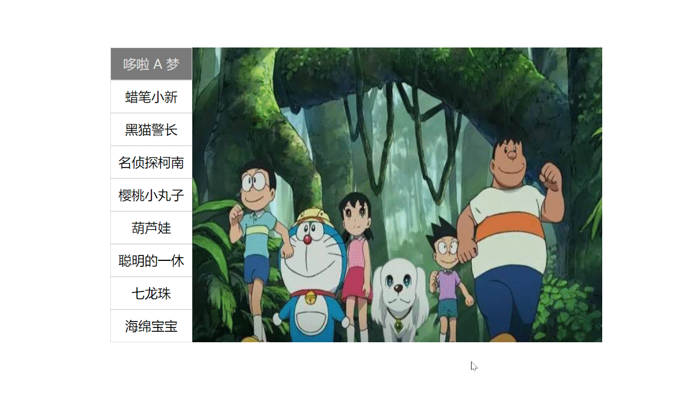
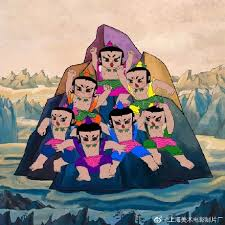

# 使用 jquery 实现鼠标移动切换图片

## 效果



## HTML

```htm
<!DOCTYPE html>
<html lang="en">

<head>
    <meta charset="UTF-8">
    <meta http-equiv="X-UA-Compatible" content="IE=edge">
    <meta name="viewport" content="width=device-width, initial-scale=1.0">
    <title>Document</title>
    <link rel="stylesheet" href="index.css">
    <script src="./js/jquery.min.js"></script>
    <script src="./js/index.js"></script>
</head>

<body>
    <!-- 主体 -->
    <div id="show" class="show">
        <!-- 左侧tab栏 -->
        <div class="left-tab">
            <ul>
                <li class="active"><a href="">哆啦 A 梦</a></li>
                <li><a href="">蜡笔小新</a></li>
                <li><a href="">黑猫警长</a></li>
                <li><a href="">名侦探柯南</a></li>
                <li><a href="">樱桃小丸子</a></li>
                <li><a href="">葫芦娃</a></li>
                <li><a href="">聪明的一休</a></li>
                <li><a href="">七龙珠</a></li>
                <li><a href="">海绵宝宝</a></li>
            </ul>
        </div>
        <!-- 右侧图片展示栏 -->
        <div class="right-image">
            <ul>
                <li></li>
                <li></li>
                <li></li>
                <li></li>
                <li></li>
                <li></li>
                <li></li>
                <li></li>
                <li></li>
            </ul>
        </div>

    </div>
</body>

</html>
```


## CSS

```css
* {
    padding: 0;
    margin: 0;
    box-sizing: border-box;
}

li, ul {
    list-style: none;
}

a {
    text-decoration: none;
}

a:visited {
    text-decoration: none;
    color: black;
}

.show {
    /* 水平居中 */
    margin: 100px auto;
    width: 605px;
}

.left-tab {
    float: left;
}

.left-tab li {
    width: 100px;
    height: 40px;
    text-align: center;
    line-height: 37px;
    border: solid 1px #ddd;
}

.right-image {
    position: relative;
    float: left;
    width: 500px;
    height: 360px;
}

.right-image li:first-child {
    display: block;
}

.right-image li {
    display: none;
}

.right-image img {
    position: absolute;
    width: 500px;
    height: 360px;
}

.active {
    background-color: rgb(122, 122, 122);
}

.active a {
    color: #ddd;
}
```


## Javascript( 需要引用 jQuery)

```js
// 入口函数
$(function () {
    // 1.鼠标经过左边的小 li
    $(".left-tab li").mouseover(function () {
        // 2. 得到当前小 li 的索引号
        var index = $(this).index();
        $(".left-tab li").removeClass("active");
        $(this).addClass("active");
        // 让右侧对应的图片显示
        $(".right-image li").eq(index).show();
        // 让其余的隐藏
        $(".right-image li").eq(index).siblings().hide();
    });

})
```

