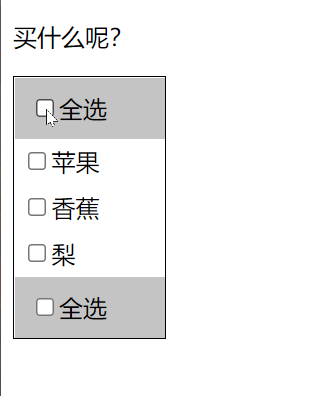

# 使用 jQuery 实现全选按钮



## index.html

```html
<!DOCTYPE html>
<html lang="en">

<head>
    <meta charset="UTF-8">
    <meta http-equiv="X-UA-Compatible" content="IE=edge">
    <meta name="viewport" content="width=device-width, initial-scale=1.0">
    <title>全选案例</title>
    <link rel="stylesheet" href="index.css">
    <script src="../jquery.min.js"></script>
    <script src="index.js"></script>

</head>

<body>
    <p>买什么呢？</p>
    <div class="main">
        <!-- 首部全选 -->
        <div class="top">
            <div class="select-all">
                <input type="checkbox" name="" id="" class="check-all">全选
            </div>
        </div>
        <!-- 中间选择的内容 -->
        <div class="content">
            <div class="single-intem">
                <input type="checkbox" name="" id="" class="check">苹果
            </div>
            <div class="single-intem">
                <input type="checkbox" name="" id="" class="check">香蕉
            </div>
            <div class="single-intem">
                <input type="checkbox" name="" id="" class="check">梨
            </div>
        </div>
        <!-- 尾部全选 -->
        <div class="foot">
            <div class="select-all">
                <input type="checkbox" name="" id="" class="check-all">全选
            </div>
        </div>
    </div>
</body>

</html>
```

## index.css

```css
.main {
    width: 100px;
    border: 1px black solid;
}

.select-all {
    background-color: rgb(196, 196, 196);
    padding: 10px;
}

.single-intem {
    padding: 5px;
}
```

## index.js

```js
$(function () {
    // 全选框改变
    $(".check-all").change(function () {
        $(".check,.check-all").prop("checked", $(this).prop("checked"));
    })
    // 选项改变
    $(".check").change(function () {
        if ($(".check:checked").length == $(".check").length) $(".check-all").prop("checked", true);
        else $(".check-all").prop("checked", false);
    })
})
```

