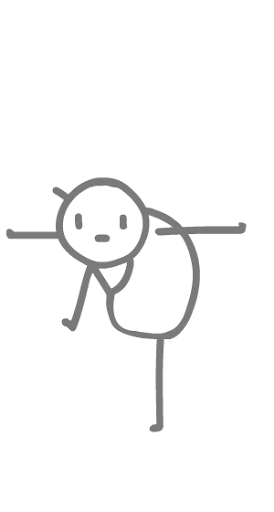

## DOM

### 阻止冒泡 

DOM 推荐的标准 stopPropagation

```html
<body>
    <div class="father">
        <div class="son">
            111
        </div>
    </div>
    <script>
        // 阻止冒泡 
        var son = document.querySelector('.son');
        son.addEventListener('click', function (e) {
            alert('son');
            // 1.stopPropagation
            e.stopPropagation();
            // 2. 非标准 取消冒泡
            e.cancelBubble = true;
        }, false);
        var father = document.querySelector('.father');
        father.addEventListener('click', function () {
            alert('father');
        });
    </script>
</body>

```

#### 实例：阻止复制.html

### 鼠标事件对象

| 鼠标事件对象           | 说明                                             |
| ---------------------- | ------------------------------------------------ |
| e.clientX<br>e.clientY | 返回鼠标相对于浏览器窗口可视区的 X 坐标和 Y 坐标 |
| e.pageX<br>e.pageY     | 返回鼠标相对于文档页面的 X 、Y 坐标（IE9+ 支持） |
| e.screenX<br>e.screenY | 返回鼠标相对于电脑屏幕的 X、Y 坐标               |

#### 鼠标事件对象1.html

```html
<body>
    <script>
        document.addEventListener('click',function(e){

            console.log('e.clientX:'+e.clientX+'   e.clientY:'+e.clientY);

            console.log('e.screenX:'+e.screenX+'   e.screenY:'+e.screenY);

            console.log('e.pageX:'+e.pageX+'   e.pageY'+e.pageY);

        })
    </script>  
</body>
```

#### 案例：鼠标移动.html

跟着鼠标移动的小人物

~~~html
<body>
    <!-- 导入图片 -->
    
    <script>
        document.addEventListener('mousemove',function(e){
            var img=document.querySelector('img');
            img.style.left=e.clientX+'px';
            img.style.top=e.clientY+'px';
        })
    </script>
</body>
~~~


# 动态创建表格

```xml
<!DOCTYPE html>
<html lang="en">

<head>
    <meta charset="UTF-8">
    <meta http-equiv="X-UA-Compatible" content="IE=edge">
    <meta name="viewport" content="width=device-width, initial-scale=1.0">
    <title>Document</title>
    <style>
        table {
            margin: 100px auto;
            border: 1px solid #000;
        }
        
        td {
            padding: 10px;
            border: 1px solid rgb(184, 177, 177);
        }
    </style>
</head>

<body>
    <table>
        <thead>
            <tr>
                <td>姓名</td>
                <td>ID</td>
                <td>操作</td>
            </tr>
        </thead>
        <tbody>

        </tbody>
    </table>
    <script>
        datas = [{
            name: 'a',
            id: 1
        }, {
            name: 'b',
            id: 2
        }, {
            name: 'b',
            id: 2
        }, {
            name: 'b',
            id: 2
        }, {
            name: 'b',
            id: 2
        }]
        var tbody = document.querySelector('tbody');
        for (var i = 0; i < datas.length; i++) {
            var tr = document.createElement('tr');
            // 注意遍历对象的方法
            for (var j in datas[i]) {
                var td = document.createElement('td');
                td.innerHTML = datas[i][j];
                tr.appendChild(td);
            }
            var td = document.createElement('td');
            td.innerHTML = "<button>删除</button>"
            tr.appendChild(td);
            tbody.appendChild(tr);
        }
        var del = document.querySelectorAll('button');
        for (let i = 0; i < del.length; i++) {
            del[i].onclick = function() {
                tbody.removeChild(this.parentNode.parentNode);
            }

        }
    </script>
</body>

</html>
```

# 事件

## 删除事件

```javascript
<div>1</div>
    <div>2</div>
    <div>3</div>
    <script>
        var div = document.querySelectorAll('div');
        div[0].onclick = function() {
                alert(11);
                // 1. 传统方法删除事件
                div[0].onclick = null;
            }
            // 2. removeEventListener 删除事件】
        div[1].addEventListener('click', fn);

        function fn() {
            alert(22);
            div[1].removeEventListener('click', fn);
            console.log(123);
        }
        //3.存在兼容性问题
        div[2].attachEvent('onclick', fn1);

        function fn1() {
            alert(33);
            div[2].detachEvent('onclick',fn1);
        }
    </script>
```

## DOM 事件流

**事件流：**从页面种接收事件的顺序

事件发生时会在元素节点之间按照特定的顺序传播，这个传播过程就是 DOM 事件流

三个阶段：

1. 捕获阶段
2. 当前目标阶段
3. 冒泡阶段

**注意：**

1. JS 代码只能执行捕获阶段或者冒泡阶段的其中一个阶段
2. onclick 和 attachEvent 只能得到冒泡阶段
3. addEventListener （type ， listener ，useCapture）的第三个参数如果是 true，表示在事件的捕获阶段调用事件处理程序，如果是 false或者没写（默认），则表示在事件冒泡阶段调用事件处理程序
4. 实际开发很少用事件捕获
5. 有些事件是没有冒泡的，如 onbur、onfocus等

### 捕获阶段

```javascript

```

### 冒泡阶段

![图片](data:image/png;base64,iVBORw0KGgoAAAANSUhEUgAAAw4AAAJiCAYAAABuA5XYAAAgAElEQVR4Ae3BCcAlZEEv/P/zvOedgWEZRFwYQZQQWYRcBktUzJUsISQNCQSNSltVbiEIlgtc0Uu2YYo3Vh2SpQ8ENEAIZS0WEeZIQAiKwFDMjWWAgXnPOc/X6/3G5vLBPEBWzuX3+5Wf/MmfbAEAAFiNGgAAgI4aAACAjhoAAICOGgAAgI4aAACAjhoAAICOGgAAgI4aAACAjhoAAICOGgAAgI4aAACAjhoAAICOGgAAgI4aAACAjhoAAICOGgAAgI7BeDwOAADA6gwmk0kAAABWZ7BixYoAAACszuBZz3pWAAAAVqcGAACgowYAAKCjBgAAoKMGAACgowYAAKBjcM899wQAAGB1agAAADpqAAAAOmoAAAA6agAAADpqAAAAOmoAAAA6agAAADpqAAAAOmoAAAA6agAAADpqAAAAOmoAAAA6agAAADpq1kBtp4Nz5t9dneGlx2Wv0tJaC/+mlENzxnCY4RmH5sdFKYfmjOEww0uPy16lBQCANUvNGuKtf3lOhsPL8rm3tqzUHrgns2qtebJGOx+ZS4bDXPDZt2SlttPB+cypX8/V1w4zHA5z7Te/ntM//e68dHqU8XicVY1esneOOPFruWQ4zHA4zHB4WS487TN5y8tKpkajrKpl47z1T/46F191TRYvXpzhcJirLzg5B7x247TWsqpSDs0Zw2GGw2GGw2GGw2GGw2GGw2GGZxwaAAD4z1TzGLZ739G5+KprcvpH8l9uPPXL2XP7jdOW/H0+f9Y45cLDsusrXprt3/SBnJia1lqejFJK9n3HS7N+bstlx52ZUkraTgfnrE+9La/Zam5uv/q8fPm8S/K9FfPzE2/cP39+1LuzaZJSSn5gnXfmhD/+vfzs9htn/I/fyPnnn59rb2+Zv/mrcvifH5t9nzZImx6llJKWjbP3sX+dj71+y6xz3w258MIL843rlyYbbJF3/o/P5BM/nZRSstLkHQvy9Pyr+27LzTffnJtvvjk333xzbr755tx003dSSsmP0nbvOzoXX3VNTv9IAADg/2eQR1FKyfYv3jrz59QsTVJKSWst/xVKKdnswN2z9dol1595VK5ZnmSQtNby79XmH5A9dlg/5ea/zZGXTjKZWpCP/O5u2WzdSS4/fPf8+pfuyng8Tpu3d06+4Pez1Yv3yx+87YS897SWUkp2+9O985INB7nrogPzut/8Slpradk4ex/71zlw4cuyx8cX5tgPXJXWWsY7H5zf3GH9lJtPz36/eGCuWZ5Mpqez4yGn5k/3eEF2PfiwHPnzB+WOqams6q5rjswu7z0zpZT8RymlZPsXb535c2qWJimlpLUWAABYqeZRtNYyq5SS/2qt7ZDffcVPpCy7Kqcfel0m09P5USil5FUfe0M2nVmRb558cJYMBhnvfHAWbjJIvflvcsjxt2U0GmVWW3Fs9v/yjRkPNsp2u+yTWa21bL/BhpmqD+e7l3wlP9TuyBfPvT73lZJ11986rbWUUrLvO16a+VmWi489ON+cGWQ8GGTWRUd8IVfeMU7bfGH2m18zGAyyqnv/6azUWvMfqbWWWaWUAADAo6lZ55353LlX59rhVbnkmHdmwR5H5ZLhMAftsH5mbfG2YRYvXpzFw7Pz4XVbpkajzBq9ZO8cceLXcvFV12Q4HGY4HObqvzs7p3585ywYj1NKyUp7HXtphsPLcszeG+dNHzkqZ/7d1Vm8eHGGw2GuvuDkfHKP5+SxtD3fmx03rrnrmlNzYmpaaynl0JwxHGZ46XHZq7SstPU79s/nzr06V187zHA4zLXDq3LRqQflLXMmeaTxWr+QvbfaKNPLr83JJ7fUmZkMXvncPG+dQf7hikW5fa2WUkpaaykzg9z2mSvy/Zqsv+nLsmA8Tikl197zLxmNp7Pu87dKnZnJrFJKNt18/cxPsuLhu9Nay6jumV/Ydt3kvhty0en5odZa6vLTc9Hty1MyP5vvVjMajTKrbL1R5uffr+10cD5z6tdz9bXDDIfDDC89O58/YGFKKSmlpO15TC4ZDnPQDutn1hZvG2bx4sVZPDw7H163pZRDc8ZwmOEZh2brd+yfz517dYbDYYbDYS469aC86VkbZrL2bvnMqV/PlcNrMxwOs3h4dj5/wMKUUgIAwP8d6qdO2j87Prtm2eV/krfve1xuvfGiXPLVr+biO2bSWst3rzov55xzbk45+eLc/EAymprKaOcj83d/+ft504uemcmtF+f888/P2dcuyQPTG+cFu34qpxz/rmw8GqWUklWtt+uf5RNveUXmL7k0Z59zXr5x/dLk6dvk5z98ao7du+SRWmvZ+01bZf7cJbnsuDOzOm3PY/KXh/xKdtzo3tx+9Xn58nmXZHj7w3naghdm/kzJqlprye57ZuGCqdx++ZE58+GS8WCQvTbdKKXcn+W3XJc6mk5rLbNKKRkv+36WLh2lrLNBXjuoaa3ltPd9Md+6e5Kt9vjj/MkeO2W9wfxst8uf5aQ9t0ruuzJfOOCsZM44g8k2WWteTZbelkWt5JEWfX9pkvXytC1aSin5N8ty900lrbU8GTPrbZljP/b27Pj0f86FF5yfb1y/NG2952THff48x+yVtNYyvv5v840zzsjFd8yktZbvXnVezjnn3Jxy8sW5+YH80Mx6W+bw39or2zxwab583iW55f6ZbPDCX84n/2y/HHHKH2bHTR7K33/jopx97ZI8vOLZ2XGfP89nd5uktRYAANZ8gzdvNsg9N5yY973n2Pzz3LUyuPqL+f1vtux93GV51YL1M7rl/dn/sFEGy5PR2kkbvC1/+d9emQ3mPpjLD989+y26M5PJJIPxOOP5784xX/lvWfjy9+fwfU/IvovyQ62tm622WS9f/fib86FF38tkejqztt7/pJzw7q2ycN8/zktP+u18c2aQlcrTDsweO6yf0bdPy5GXTpJBzWP5wM+9MPOzLFd8+rV59xdbVlr4xl0zGYyTmUF+qCzIR9+6eeY+dFMuPuSKZM44ZTSdLdabziQ149RMJpOUUjKrtZaV2pz1s/k6SVvWkhXH5t1/8NyccsQeee1HP5/LPpofaA/dmDM+sG+OfmicMjPIzM4b5Onpm/+st6S1szLrrQvmZmayXnY4cHGGByaTPJzxXd/J6X99cv7nn56UJYNBWmtZnamnvzAvvPKI/Py+x2XJYJBZr/zTc/PZ1z47L97l99K+8KlMf2tRPnR1y17H/kxetWD9jG55f/Y/bJTB8mS0dlJH+YHBRltnrfPfndd84KrMavMPyMnn7pWtt9knP7fsqpz0hn3zsYfHGSxPXvEXF+Szr312tttln5TTvhAAANZ8tdzy5bxvz4/nmuXJeDzOrFJKVjXd1sp4MEhWTCW775mfevZ07r38L/LrX7orrbWUUjKZnk5bcWze9T9vyIpMZ7tdDshkMslKpZQsvejIHPCl2zIeDNJaS2st1/3REbnyjnGy8Vb5+blTGQwGmVVKyas+9oZsOrMii8/8VP557txMJpOszmQyL+s+f6tMjUaZ1VrLFed+Od+cGeT/sNOv5GVbrZ37rj0thz88J3U0ndZaZpXclZtPn2QwHudRrTUvswbjcfKKP8wpR+yRbeY9kO9edV6++tWv5hvXL83Da22RNx9+SvZba5A2PcrUhvMy696lN2R15sx9Wma11rL8n2/P7Vefl785+2s57bLvZsntSzPYaOv84nsPyinHvyuj0Sg9ZcV3cvbvnpDb12qZ1VrLxX9wXm4pJYMNn5PnTCZpreWRpttaGQ8GKTOD/NDD/5iLD7kio9Eos8q9n8qlNyxLKSW3X35kPvbwOHU0nfFgkK9/5Ybcu2KS+Ru9MK21AACw5quf3uuQXD2azngwSGstj2Y0GmVWrTW/+NoNMuuuW7+QmZmZrNRaSx1NZ+rEf8wdqRls+JzsMreltZZZkzyc719yZjJnnFJK/s3luej25SmZnxfslozH48war/UL2XurjTK9/NqcfHLLzMxMSil5NKWUnHzWMMvqVLbe45h8edGR2WXHzTIYj1NrzapKKdl9n52yeZZl8ZknZDQapbWWUkrWWWuQWWtvm0ymp/Noyn13ZtZ4sGM+8ru7Zat5M7n88N3zln3fnwMOOCC/9bafya4fvywPPmOb7L/o0Lws/2beOs9Oay2P5f77/iGzaq055+D9ssu7PpDf/70P5JBf/fnsvPPO+eUPXZDrH5zO+i/fK5/csabr7ltz9L2TTLe1MplMUkpJuXe9zCrrbJDXDmoezWg0yiOVO67L0fdOMhgM0lrLrLtGJcmy3HHlVSkzg7TW0lrL9Ln35F/mTmVWKSUAAKz56tEPjdJay+qUUjKrtZZ5U+tlui7L3TeVlFKyqtZaRvW6LF06Sllng8yfKam1ZlbNioxTU0fTaa3l0YxT01pLay3Zfc8sXDCV2y8/Mmc+XFJKyeosOfm9ee9Bf5tb7l8rz33Zq3PY587IBWcelcNePklrLSuN6p7Zc/uN05b8fT5/1jittcxqreWau5anZH42eUHSWstjufmBZLTzPlm4ySDjb38p+y26MyuVUnL7SR/JudcvT9t8Yd720qnUL92R/5Vkeu35KaXksSy/58qUUtJay6zWWmaVUtJay7dO/6381bVLkvacbPPmklJKVqcsvz9LBoOMRqOUUtJay+NRSsmjuWNqKq21zGqt5dGUUgIAwP996rF7bJrWWp6I1tbN07Zoaa3lkQaTbbLRRoO0B+7JPwzGaa1lVa21PNIW601nkjmZ1VpLyoJ89K2bZ+5DN+XiQ65I5oxTSsljaa2ltZZrz/7N7PLTL8kehy7KpXdO8rQtdsounzktf7Be0qZHKaVkswN3zzbzaq6/8Khcszz/h+8teyCtrZv1tygppWRVU+ttmo02GiRLb8sXJ8nUhvOy8bpTefCBO9Nay0qttZQsyU3LZtLyjGzygqTNX5aHHpwkG22SvUpLay2r2mvTjZIsy903lUwmk8xqrWVVpZQMBoOcdsfDKaXk8WqtBQAA/r3qDu//TD7x00kpJY/UWssjLfr+0kwmkzzjue9MrTWraq1l8o4FWZBJ7vv+Vbm2rZV/s14WLHxZHmk89cvZ9rlzU+9bnIu+3DIYjzPe+eAs3GSQ+649LYc/PCd1NJ3WWnrKzCCllFx/0h/nPW/6uRx+5bKUtbbMy36vpI6m09oO+d1X/ERy35U5/dDrMpmezqouuuz7ua+UbLb172cymWSlUko2+a0dsnmS228+PSs9nJp56zw7C8bjlFKyUsvG2WK96cx68IGk3XNCvn3rw2nrPzvbvjyptWalydq75dXPWTvtoSU5b9Ekg/E4pZQ8mtZa3rpgblprmTWZTPKj1FoLAAA8mvrwWltkl8+clsNePkkpJSst+v7SlFKy9gYLs1JrLeOPfilX3d0y/+W/maP3enZWVdbdJ8e+56WZs+JfsvjMEzIej7OqBa/6UP77T7Ws1LJx9vnL384282ruvf78HHt/yay3v/0Fef66D2XxmSdkNBqltZaehW/cNQvG48xqraVkSb637IG01jJrMplktPM+eeXzpnPXNafmxNS01rKqdvoZWXzHTKa33T3HvnNBxuNxSilp8/bOp39hy7SHbszFh1yRzBlncvJ5uWHpKNPb7p5D990kq9r+fYfmjc+fk7Lkopz1lZZa7szRV38vo8km2fXgw7LxaJRSSma9+vfemYULprL0imOyqJWMB4O01vJoFuxxVH7lRc9MWXZVTvloS601PyqLvr80pZSsvcHCAADAIw0+edGtOWjHLbLrHx+fm3Z+V45+aJQ6ms7MJbfm3t03z8Y7HZEjj/x2Ntxww1z3a+/If7/nhBzy2dfklA+/Mjt88Nxc+IsX5upbR5l5xjb56Rc+M+vPHeXG0z6R95w1TiZJKSX/27L80z3r5y2f/Ua2X/ytXHP32nnRyxZm8w3mJPddmaPf94UkJSvm7pM9t984bcnf5vNnjdNayePxS+/7aH72k/vn1sXfynX/tCLrbP7y/OTzn5ay7Kqc8UdJ5oyz7ztemvVzW8487swkNatqraUuPz0fO/rNOeXDr8zLD/x/8jdv/Ptcc/fa2e4Nr8ymMytyw1lH5WMPj1NmBqltUQ757GtyyodfmYUHnpUz37Ek/3TnnVl7022y3YL1Usr9ufz4T+YrM1OZTCa57bBP5WuvOCo/+7xd8pULt8yF1y7J4Dk/mR233CjT912ZvzjgrLTpUepoOqO6Z0766m9n/Zl/yeSmy7I4z83zt94uL9xobubOfSiXH35QTkxNay3jqV/O8ecfkJdvtDxXHL5j3vWFSUrJEza65Nbcu/vm2XinI3Lkkd/OhhtumOt+7R059IEAAEDqyb/xa/mjb96frL8w+59zXPZba5DJYCZT5xyWP7nou1mRDfLqV78q2232cGaNpqay5OT35lcPPSZ/871R5m/+qrz2tT+TN73omVnnvhvyNx/fNW/78DkpM4OUUrKqf/jsH+TLV92fp73sDdn19TvmJ562InffdGE+vfO7cvRDo8za7MDds828musvPCrXLM/jdtG3b84DK9bKc17yhrz5zW/OqzdPJrdenAN/5905/u5RyjoHZ48d1k+5+coceekkrbWsqpSSUkqWnPzevP3jl+Q7d8/JZi99fXZ9/Y7Z9P7bcsVf/Xp+8ZCzU2YGmVVrzZKT35tfPfSYXHT9smy22WZ5+U/9VF70nLm5+6YLc8Lv7J79Ft2Z1lpKKUkuzwFveU+Oueb+tPlb5HWve11es9XcLPvON/Lpnd+Vox8apcwM0lpLmfNg7vhfD2TjZz83m75uz+z6+h3zoufMzQO3/l1O+J3ds9+iO9Nay0orVrRMVjycJ6uUkqlzDssR592Q0dSG2WmnnbLdZg8HAABWKttuu23L/6eUkpVaa2mtpZSSUkpaa2mtpdaayWSSyWSSqamprNRaSyklpZS01rKqvY69NAftUHLF4TvmVxYlrbXMaq0lc8b5gRVTKeWn8qmzjsrPbXhNPvHKfXNialpreaRSDs2XF++W5y85Lzu/7ndyx9RUWmsppWRVU6NRJtPTmfXKPz03f/7qp2fxH70k+y6qaa3l0bTWslIpJavTWsusUkpWVUpJay2PZmo0ymR6Oq21tNaSOeP8wIqplFLSWsusUkoeqZSS1lpWVUrJrNZaWmsppeTJKKVkVmsts1prWVUpJQAAPHUNsorWWlZVSsms1lpmlVLSWkspJVNTU1lVKSWzWmtZndZaViqlJDOD/EBJ2p7vzY4b19x1+ak5MTWttTyamTdtkHL/TEb/cnturzUlSSkljzQeDJLWMll7t+y91UaZXn5NTj65ZTKZpJSSR1NKyeNVSsmjaa3lsYwHg6S1zCqlJDOD/EDJD5RS8lhaa3mk1lpWKqXkyWqtZVWllLTWUkoJAAAM8mOitZac+O686q9KVqe1lre//QV53jqDXD88K4PxOOPBII+ltZa6/PS8542nZVYpNaWEx6GUEgAAmDXIj4lSSlbniBO/lq1mvp3vrfPivOIFGyZ3np/jP/ntjAeDrE4pJbNKKQEAAJ6cQdYQt43nZeeXvj7PLStyzz9elOP2eX/ObJOU1AAAAP+xyrbbbtvyY66Uklmttcxq06OUmUEAAID/HIOsAVprWVWZGQQAAPjPUwMAANBRAwAA0FEDAADQUQMAANBRAwAA0FEDAADQUQMAANBRAwAA0DHYYIMNAgAAsDo1AAAAHTUAAAAdNQAAAB01AAAAHTUAAAAdg+c973kBAABYnRoAAICO0v5VAAAAVqMGAACgowYAAKCjBgAAoKMGAACgowYAAKCjBgAAoKMGAACgowYAAKCjBgAAoKMGAACgowYAAKCjBgAAoKMGAACgowYAAKCjBgAAoKMGAACgowYAAKCjBgAAoKMGAACgowYAAKCjBgAAoKMGAACgowYAAKCjBgAAoKMGAACgowYAAKCjBgAAoKMGAACgowYAAKCjBgAAoKMGAACgowYAAKCjBgAAoKMGAACgowYAAKCjBgAAoKMGAACgowYAAKCjBgAAoKMGAACgowYAAKCjBgAAoKMGAACgowYAAKCjBgAAoKMGAACgowYAAKCjBgAAoKMGAACgowYAAKCjBgAAoKMGAACgowYAAKCjBgAAoKMGAACgowYAAKCjBgAAoKMGAACgowYAAKCjBgAAoKMGAACgowYAAKCjBgAAoKMGAACgowYAAKCjBgAAoKMGAACgowYAAKCjBgAAoKMGAACgowYAAKCjBgAAoKMGAACgowYAAKCjBgAAoKMGAACgowYAAKCjBgAAoKMGAACgowYAAKCjBgAAoKMGAACgowYAAKCjBgAAoKMGAACgowYAAKCjBgAAoKMGAACgowYAAKCjBgAAoKMGAACgowYAAKCjBgAAoKMGAACgowYAAKCjBgAAoKMGAACgowYAAKCjBgAAoKMGAACgowYAAKCjBgAAoKMGAACgowYAAKCjBgAAoKMGAACgowYAAKCjBgAAoKMGAACgowYAAKCjBgAAoKMGAACgowYAAKCjBgAAoKMGAACgowYAAKCjBgAAoKMGAACgowYAAKCjBgAAoKMGAACgowYAAKCjBgAAoKMGAACgowYAAKCjBgAAoKMGAACgowYAAKCjBgAAoKMGAACgowYAAKCjBgAAoKMGAACgowYAAKCjBgAAoKMGAACgowYAAKCjBgAAoKMGAACgowYAAKCjBgAAoKMGAACgowYAAKCjBgAAoKMGAACgowYAAKCjBgAAoKMGAACgowYAAKBjEIAfc5+8eml4fD543y3hcXrNDgHg8asBAADoqAEAAOioAQAA6KgBAADoqAEAAOioAViDrTj72Fxw/dI8USvOPjYXXL80T9TU9efk/LNuyGj8YADgqaQGYA1Ult+YKw7dN3/4oQNy63fHebzK8htzxaH75g8/dEBu/e44j9do/GDuO/td+R/v3z9fu3CYh0ZTAYCnkkEA1iBl+Y257i/+LCcsOilPRFl+Y677iz/LCYtOyhMxGj+YyddOynHHH5BbbggAPGUNArAGKMtvzNkHvSdfv3CYWetu+TN5Rvl6brkhq1WW35izD3pPvn7hMLPW3fJn8ozy9dxyQ7ruO/td+cSHvpJZdfCsbP3iDfIP37ohs+ZNTwcAnkpqANYQUw/dmTp4Vrb+jRPzwUXHZ4fn5nGZeujO1MGzsvVvnJgPLjo+Ozw3XZPJJN+54Ct5xjOfmS33/kR+9Zyrs9svbZGVHpyZCQA8lQwCsIbY6HUn5bDPbZ9Zo/GDebw2et1JOexz22fWaPxgHo9aaxa++4vZ4FmvyzPmTTJvap3cHwB46hoEYA3Q1t4yL/6l/ND0itvyeLS1t8yLfyk/NL3itjxeM1u+Mc+vNf/biqxq3tR6SVYEAJ4qagDWQDNzNsmTMTNnkzxetdY8lgfHywIATyU1AAAAHTUAa6DpFbflyZhecVsAgCeuBmANNDNnkzwZM3M2yY/CvOnpAMBTSQ0AT9iDMzMBgKeSGoA10PSK2/JkTK+4LQDAE1cDsAaambNJnoyZOZsEAHjiagB4wuZNTwcAnkpqANZA0ytuy5MxveK2/Cg8ODMTAHgqqQFYA83M2SRPxsycTQIAPHE1AAAAHTUAa6DpFbflyZhecVt+FOZNTwcAnkpK+1cB+DH2yauXhsfng/fdEh6n1+wQAB6/GgAAgI4aAACAjhoAAICOGgAAgI4aAACAjhoAAICOGgAAgI4aAACAjhoAAICOGgAAgI4aAACAjhoAAICOGgAAgI4aAACAjhoAAICOGgAAgI4aAACAjhoAAICOGgAAgI4aAACAjhoAAICOGgAAgI4aAACAjhoAAICOGgAAgI4aAACAjhoAAICOGgAAgI4aAACAjhoAAICOGgAAgI4aAACAjhoAAICOGgAAgI4aAACAjhoAAICOGgAAgI4aAACAjhoAAICOGgAAgI4aAACAjhoAAICOGgAAgI4aAACAjhoAAICOGgAAgI4aAACAjhoAAICOGgAAgI5BAH7MffC+WwIA/NeqAQAA6KgBAADoqAEAAOioAQAA6KgBAADoqAEAAOioAQAA6KgBAADoqAEAAOioAQAA6KgBAADoqAEAAOioAQAA6KgBAADoqAEAAOioAQAA6KgBAADoqAEAAOioAQAA6KgBAADoqAEAAOioAQAA6KgBAADoqAEAAOioAQAA6KgBAADoqAEAAOioAQAA6KgBAADoqAEAAOioAQAA6KgBAADoqAEAAOioAQAA6KgBAADoqAEAAOioAQAA6KgBAADoqAEAAOioAQAA6KgBAADoqAEAAOioAQAA6KgBAADoqAEAAOioAQAA6KgBAADoqAEAAOioAQAA6KgBAADoqAEAAOioAQAA6KgBAADoqAEAAOioAQAA6KgBAADoqAEAAOioAQAA6KgBAADoqAEAAOioAQAA6KgBAADoqAEAAOioAQAA6KgBAADoqAEAAOioAQAA6KgBAADoqAEAAOioAQAA6KgBAADoqAEAAOioAQAA6KgBAADoKO1fBQAAYDVqAAAAOmoAAAA6agAAADpqAAAAOmoAAAA6agAAADpqAAAAOmoAAAA6agAAADpqAAAAOmoAAAA6agAAADpqAAAAOmoAAAA6agAAADpqAAAAOmoAAAA6agAAADpqAAAAOmoAAAA6agAAADpqAAAAOmoAAAA6agAAADpqAAAAOmoAAAA6agAAADpqAAAAOmoAAAA6agAAADpqAAAAOmoAAAA6agAAADpqAAAAOmoAAAA6agAAADpqAAAAOmoAAAA6agAAADpqAAAAOmoAAAA6agAAADpqAAAAOmoAAAA6agAAADpqAAAAOmoAAAA6agAAADpqAAAAOmoAAAA6agAAADpqAAAAOmoAAAA6agAAADpqAAAAOmoAAAA6agAAADpqAAAAOmoAAAA6agAAADpqAAAAOmoAAAA6akGiGIEAAANNSURBVAAAADpqAAAAOmoAAAA6agAAADpqAAAAOmoAAAA6agAAADpqAAAAOmoAAAA6agAAADpqAAAAOmoAAAA6agAAADpqAAAAOmoAAAA6agAAADpqAAAAOmoAAAA6agAAADpqAAAAOmoAAAA6agAAADpqAAAAOmoAAAA6agAAADpqAAAAOmoAAAA6agAAADpqAAAAOmoAAAA6agAAADpqAAAAOmoAAAA6agAAADpqAAAAOmoAAAA6agAAADpqAAAAOmoAAAA6agAAADpqAAAAOmoAAAA6agAAADpqAAAAOmoAAAA6agAAADpqAAAAOmoAAAA6agAAADpqAAAAOmoAAAA6agAAADpqAAAAOmoAAAA6agAAADpqAAAAOmoAAAA6agAAADpqAAAAOmoAAAA6agAAADpqAAAAOmoAAAA6agAAADpqAAAAOmoAAAA6agAAADpqAAAAOmoAAAA6agAAADpqAAAAOmoAAAA6agAAADpqAAAAOmoAAAA6agAAADpqAAAAOmoAAAA6agAAADpqAAAAOmoAAAA6agAAADpqAAAAOmoAAAA6agAAADpqAAAAOmoAAAA6agAAADpqAAAAOmoAAAA6agAAADpqAAAAOmoAAAA6agAAADpqAAAAOmoAAAA6agAAADpqAAAAOmoAAAA6agAAADpqAAAAOmoAAAA6agAAADpqAAAAOmoAAAA6agAAADpqAAAAOmoAAAA6agAAADpqAAAAOmoAAAA6agAAADpqAAAAOmoAAAA6agAAADpqAAAAOmoAAAA6agAAADpqAAAAOmoAAAA6agAAADpqAAAAOmoAAAA6agAAADpqAAAAOmoAAAA6agAAADpqAAAAOmoAAAA6agAAADpqAAAAOmoAAAA6agAAADpqAAAAOmoAAAA6agAAADpqAAAAOmoAAAA6agAAADpqAAAAOmoAAAA6agAAADpqAAAAOmoAAAA6agAAADpqAAAAOmoAAAA6agAAADpqAAAAOmoAAAA6agAAADpqAAAAOmoAAAA6agAAADpqAAAAOmoAAAA6agAAADpqAAAAOmoAAAA6agAAADpqAAAAOmoAAAA6agAAADpqAAAAOmoAAAA6agAAADpqAAAAOmoAAAA6/l+rLzQRe8tS9gAAAABJRU5ErkJggg==)

```javascript
<div class="father">
        <div class="son">
            111
        </div>
    </div>
    <script>
        // 冒泡阶段
        var son = document.querySelector('.son');
        son.addEventListener('click', function() {
            alert('son');
        });
        var father = document.querySelector('.father');
        father.addEventListener('click', function() {
            alert('father');
        });
    </script>
```

# BOM 学习目标

- 说出什么是 BOM
- 了解浏览器的顶级对象 window
- 写出页面加载事件以及注意事项
- 写出两种定时器函数并说出区别
- 说出 JS 执行机制
- 使用 location 对象完成页面之间的跳转
- 知晓 navigation 对象涉及的属性
- 使用 history 提供的方法实现页面刷新

#  BOM 概述

## 什么是 BOM 

- 是浏览器对象模型，提供了独立于内容而与浏览器窗口进行交互的对象，核心对象是 window。

- 由一系列相关的对象构成，并且每个对象都提供了很多方法和属性

- 缺乏标准

## BOM 和 DOM 的比较

| DOM                  | BOM                              |
| -------------------- | -------------------------------- |
| 文档对象模型         | 浏览器对象模型                   |
| 把文档当作一个对象   | 把浏览器当作一个对象             |
| 顶级对象是 docment   | 顶级对象是 window                |
| 主要学习操作页面元素 | 主要学习浏览器窗口交互的一些对象 |
| W3C 标准规范         | 各自定义，兼容性差               |

## BOM 的构成

# window 对象的常见事件

## 窗口加载事件

~~~js
window.onload = function(){};
window.addEventListener('load',function(){});
~~~

`window.onload`是窗口加载事件，当文档内容完全加载完成会被执行该事件

- 函数可以写在页面元素上方
- window.onload 若有多个，则以最后一个为准，若是使用`addEventListener`则不限制

```js
document.addEventListener('DOMContentLoaded',function(){});
```

等待DOM加载完毕，不包含图片 false css等就可以执行

## 调整窗口大小事件

```js
window.onresize=function(){};
window.addEventListener('resize',function(){});
```

- window.innerWidth 是当前屏幕宽度，这个时间常用于响应式布局

# 定时器

- setTimeout（）
- setInterval（）

## window.setTimeout()

```js
window.setTimeout(function(){},[time])
```

`time`:时间的单位是 ms ，可选

`function`：可直接写，也可调用

[]是可选的意思

- 定时器可以赋值以区分

**回调函数**

### 案例： 自动关闭广告.html

5 s 自动关闭广告

```html
<!DOCTYPE html>
<html lang="en">
<head>
    <meta charset="UTF-8">
    <meta http-equiv="X-UA-Compatible" content="IE=edge">
    <meta name="viewport" content="width=device-width, initial-scale=1.0">
    <title>Document</title>
    <style>
        img{
            /* 广告大小 */
            width: 300px;   
            /* 广告显示 */
            display: block;
        }
    </style>
</head>
<body>
    <!-- 广告图片 -->
    
    <script>
        var img=document.querySelector('img');  
        // 设置关闭定时器
        setTimeout(function(){
            // 关闭广告
            img.style.display = 'none';
        },5000);
    </script>
</body>
</html>
```

## 停止 setTimeout（）定时器

```js
clearTimeout(timer);
```

`timer`:定时器的名字

## setInterval( ) 定时器

`window.setInterval(function(){},time);`

- 每隔 time 就调用一次 function
- 轮播图的实现方法

### 案例：倒计时.html

```html
<!DOCTYPE html>
<html lang="en">
  <head>
    <meta charset="UTF-8" />
    <meta http-equiv="X-UA-Compatible" content="IE=edge" />
    <meta name="viewport" content="width=device-width, initial-scale=1.0" />
    <title>Document</title>
    <style>
      * {
        padding: 0;
        margin: 0;
        font-size: 30px;
        box-sizing: border-box;
      }
      div,
      span {
        display: inline-block;
      }
      section {
        height: 100px;
        margin: 200px auto;
        text-align: center;
      }
      h3 {
        font-size: 40px;
        margin: 30px;
      }
      div {
        margin: 0 20px 0 20px;
        width: 70px;
        padding: 10px 0 10px 0;
        border: 1px solid black;
        text-align: center;
      }
    </style>
  </head>
  <body>
    <section>
      <h3>距离七夕还有</h3>
      <div id="months"></div>
      <span>个月</span>
      <div id="days"></div>
      <span>天</span>
      <div id="hours"></div>
      <span>小时</span>
      <div id="minutes"></div>
      <span>分钟</span>
      <div id="seconds"></div>
      <span>秒</span>
    </section>
    <script>
      var months = document.getElementById("months");
      var days = document.getElementById("days");
      var hours = document.getElementById("hours");
      var minutes = document.getElementById("minutes");
      var seconds = document.getElementById("seconds");
      var countdown = function () {
        var birTime = new Date("2021-08-14 00:00:00").getTime() / 1000;
        var nowTime = new Date().getTime() / 1000;
        var disTime = parseInt(birTime - nowTime);

        seconds.innerHTML = disTime % 60;
        minutes.innerHTML = parseInt(disTime / 60) % 60;
        hours.innerHTML = parseInt(disTime / 60 / 60) % 24;
        days.innerHTML = parseInt(disTime / 60 / 60 / 24) % 60;
        months.innerHTML = parseInt(disTime / 60 / 60 / 24 / 30) % 60;
      };
      setInterval(countdown, 1000);
    </script>
  </body>
</html>

```

####  发送短信.html


## 可视区 client 系列

| client 系列属性                               | 作用                                                         |
| --------------------------------------------- | ------------------------------------------------------------ |
| element.clientTop                             | 返回元素上边框的大小                                         |
| element.clientLeft                            | 返回元素左边框的大小                                         |
| element.clientWidth<br />element.clientHeight | 返回自身包括 padding、内容区的宽度，不含边框，返回的数值不带单位 |

### 立即执行函数

不需要调用，立马能够直接执行

### 写法

`(function(){})()`或者`(function(){}())`

主要作用：创建一个独立的作用域，避免命名冲突问题

### scroll 系列

| scroll系列属性                                | 作用                                                         |
| --------------------------------------------- | ------------------------------------------------------------ |
| element.scrollTop                             | 返回被收起的元素上侧的大小                                   |
| element.scrollLeft                            |                                                              |
| element.scrollWidth<br />element.scrollHeight | 返回自身实际大小包括 padding、内容区的宽度，不含边框，返回的数值不带单位 |

#### 案例：淘宝右侧侧边栏.html

# mouseenter 和 mouseover 的区别

- 鼠标移至元素上方会触发该事件
- mouseover 鼠标经过自身盒子会触发，经过子盒子还会触发
- mouseenter 指挥经过自身盒子触发，因为它不会冒泡

# 动画原理

动画原理.html

 

```html
<!DOCTYPE html>
<html lang="en">
  <head>
    <meta charset="UTF-8" />
    <meta http-equiv="X-UA-Compatible" content="IE=edge" />
    <meta name="viewport" content="width=device-width, initial-scale=1.0" />
    <title>Document</title>
    <style>
      div {
        position: absolute;
        left: 0;
        height: 100px;
        width: 100px;
        background-color: pink;
      }
    </style>
  </head>
  <body>
    <button>点击</button>
    <div></div>

    <script>
      // 动画原理
      var div = document.querySelector("div");
      //   var move = setInterval(function () {
      //     div.style.left = div.offsetLeft + 1 + "px";
      //     if (div.offsetLeft >= 600) clearInterval(move);
      //   }, 30);

      function animate(obj, target) {
        clearInterval(obj.timer);
        obj.timer = setInterval(function () {
          if (obj.offsetLeft >= target) clearInterval(timer);
          else obj.style.left = obj.offsetLeft + 1 + "px";
        }, 30);
      }
      var btn = document.querySelector("button");
      btn.addEventListener("click", function () {
        animate(div, 150);
      });
    </script>
  </body>
</html>

```

## 缓动效果原理

让元素运动渡有所变化（速度慢慢停下来

算法：
$$
每次移动的距离=\frac{目标值-现在的位置}{10} 
$$
停止条件：盒子位置 = 目标位置

# JS 执行机制

## JS 是单线程

## 同步和异步

 ## 同步任务和异步任务

### 同步任务

在主线程上执行，形成一个执行线

### 异步任务

通过回调函数实现的。

异步任务的类型：

1. 普通事件
2. 资源加载
3. 定时器

异步任务相关回调函数添加到任务队列中

## JS 执行机制

1. 先执行 执行栈中的同步任务
2. 异步任务放到 任务队列里
3. 一旦执行栈中的所有同步任务执行完毕，系统将开始按照次序读取任务队列中的异步任务，于是被读取的异步任务结束等待状态，进入执行栈，开始执行

## 事件循环

# location 对象

## ## URL

一般语法格式：

```
protocol://host[:post]/path/[?query]#fragment
```

| 组成     | 说明                                   |
| -------- | -------------------------------------- |
| protocol | 通信协议 常用的有 http、ftp、maito     |
| host     | 主机（域名）                           |
| port     | 端口号，可选，http的默认端口号为80     |
| query    | 参数 以键值对的形式，通过`&`符号分隔开 |
| fragment | 片段、 #后面内容常见于链接、锚点       |

## location 对象的属性

| location对象属性    | 返回值              |
| ------------------- | ------------------- |
| **location.href**   | 获取或者设置整个URL |
| location.host       | 返回主机（域名）    |
| location.port       | 返回端口号          |
| location.pathname   | 返回路径            |
| **location.search** | 返回参数            |
| location.hash       | 返回片段            |

## location 对象的方法

| 对象方法           | 返回值                                                       |
| ------------------ | ------------------------------------------------------------ |
| location.assign()  | 跟 href 一样，可以跳转页面（重定向页面）                     |
| location.replace() | 替换当前页面，因为不能记录历史，所以不能后退页面             |
| location.reload    | 重新加载页面，相当于刷新按钮或者 f5.如果参数为 true 则为强制刷线 |

# navigator 对象

# history 对象

| history对象方法 | 说明                                                     |
| --------------- | -------------------------------------------------------- |
| back（）        | 可以后退                                                 |
| forward（）     | 前进                                                     |
| go（参数）      | 前进后退功能<br />1为前进1个页面<br />-1 为后退 1 个页面 |

#  PC 端网页特效

## 学习目标

- 能够说出常见的 offset 系列属性的作用
- 能够说出常见的 client 系列属性的作用
- 能够说出常见的 scroll 系列属性的作用
- 能够封装简单动画函数
- 能够写出网页轮播图案例

 # 元素偏移量 offset 系列

## offset 概述

offset 可以动态地得到该元素的位置（偏移）、大小等

- 获得元素距离带有定位父元素的位置
- 获得元素自身的大小
- 注意: 返回的数值都不带单位

| offset 系列属性      | 作用                                                         |
| -------------------- | ------------------------------------------------------------ |
| element.offsetParent | 返回作为该元素带有的父级元素<br />如果父级元素都没有定位则返回 body |
| element.offsetTop    | 返回带有相对定位父元素上方的偏移                             |
| element.offsetLeft   | 返回带有相对定位父元素左边框的偏移                           |
| element.offsetWidth  | 返回自身包括边框的宽度<br />不带单位                         |
| element.offsetHeight | 返回自身包括边框的高度<br />不带单位                         |

## offset 和 style 的区别

| offset                                   | style                                      |
| ---------------------------------------- | ------------------------------------------ |
| 可以得到任何样式表中的样式值             | 只能得到行内样式表中的样式值               |
| 获得的数值是没有单位的                   | 获得的是带有单位的字符串                   |
| 包含 padding 等                          | 不包含                                     |
| 是只读属性<br />只能获取不能赋值         | 是可读写属性，可以获取也可以赋值           |
| 想要获取元素大小和位置，用 offset 更合适 | 想要给元素更改值 <br />需要使用 style 改变 |

# 获取鼠标在盒子内的坐标.html

```html
<!DOCTYPE html>
<html lang="en">
  <head>
    <meta charset="UTF-8" />
    <meta http-equiv="X-UA-Compatible" content="IE=edge" />
    <meta name="viewport" content="width=device-width, initial-scale=1.0" />
    <title>Document</title>
    <style>
      .box {
        margin: 100px auto;
        width: 300px;
        height: 300px;
        background-color: pink;
      }
    </style>
  </head>
  <body>
    <div class="box"></div>
    <script>
      var div = document.querySelector(".box");
      div.onmousemove = function (e) {
        var x = e.pageX - this.offsetLeft;
        var y = e.pageY - this.offsetTop;
        this.innerHTML = "P（" + x + "," + y + ")";
      };
    </script>
  </body>
</html>
```

# 案例：弹出框.html

拖动的模态框

弹出框，也称为模态框

1. 点击弹出层，会弹出模态框，并且显示灰色半透明的遮挡层
2. 点击关闭按钮，可以关闭模态框，并且同时关闭灰色半透明遮挡层
3. 鼠标放到模态框最上面一行，可以按住拖动模态框在页面中移动
4. 鼠标松开，可以停止拖动模态框移动

# 案例：放大镜.html

```html
<!DOCTYPE html>
<html lang="en">
  <head>
    <meta charset="UTF-8" />
    <meta http-equiv="X-UA-Compatible" content="IE=edge" />
    <meta name="viewport" content="width=device-width, initial-scale=1.0" />
    <title>Document</title>
    <style>
      .img {
        position: relative;
        margin: 100px auto;
        width: 200px;
        height: 200px;
        text-align: center;
      }
      img {
        width: 100%;
        height: 100%;
      }

      .mask {
        display: none;
        position: absolute;
        top: 0;
        left: 0;
        width: 100px;
        height: 100px;
        background: #fede4f;
        opacity: 0.5;
        cursor: move;
      }
      .big {
        /* display: none; */
        position: relative;
        position: absolute;
        left: 250px;
        top: 0;
        width: 400px;
        height: 400px;
        background-color: pink;
        z-index: 999;
        border: 1px solid #ccc;
        overflow: hidden;
      }
      .mask-img {
        position: absolute;
        top: 0;
        left: 0;
        width: 800px;
        height: 800px;
      }
    </style>
  </head>
  <body>
    <div class="img">
      
      <!-- 遮盖曾 -->
      <div class="mask"></div>
      <!-- 放大的区域 -->
      <div class="big">
        
      </div>
    </div>
    <script>
      var img = document.querySelector(".img");
      var mask = document.querySelector(".mask");
      var big = document.querySelector(".big");
      img.addEventListener("mouseover", function () {
        mask.style.display = "block";
        big.style.display = "block";
      });
      img.addEventListener("mouseout", function () {
        mask.style.display = "none";
        big.style.display = "none";
      });
      img.addEventListener("mousemove", function (e) {
        var x = e.pageX - this.offsetLeft;
        var y = e.pageY - this.offsetTop;
        var maskX = x - mask.offsetWidth / 2;
        var maskY = y - mask.offsetHeight / 2;
        if (maskX <= 0) maskX = 0;
        else if (maskX >= img.offsetWidth - mask.offsetWidth) {
          maskX = img.offsetWidth - mask.offsetWidth;
        }
        if (maskY <= 0) maskY = 0;
        else if (maskY >= img.offsetHeight - mask.offsetHeight) {
          maskY = img.offsetHeight - mask.offsetHeight;
        }
        mask.style.left = maskX + "px";
        mask.style.top = maskY + "px";
        var mask_img = document.querySelector(".mask-img");
        mask_img.style.top = -maskY * 4 + "px";
        mask_img.style.left = -maskX * 4 + "px";
      });
    </script>
  </body>
</html>
```


