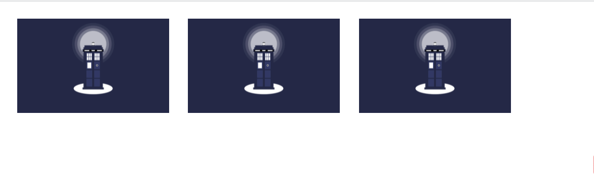
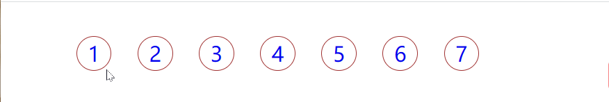
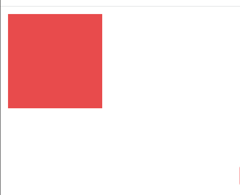

#  移动Web网页开发阶段

## 学习目标

- Flex 布局
- 媒体查询、rem、辅助响应式开发
- Less
- Bootstrap 响应式框架

## 2D 转换之缩放 scale

`transform:scale(x,y)`

x 和 y 对应的是宽和高对应的缩放倍数，1 不变，小于 1 变小，大于 1 变大

### 优势：

- 按照中心点放大，不会影响其他盒子
- 可以设置缩放的中心点（transform-origin：）

### 案例1：图片放大

#### 

#### scale1.html

```html
<!DOCTYPE html>
<html lang="en">

<head>
    <meta charset="UTF-8">
    <meta http-equiv="X-UA-Compatible" content="IE=edge">
    <meta name="viewport" content="width=device-width, initial-scale=1.0">
    <title>Document</title>
    <style>
        div {
            overflow: hidden;
            float: left;
            margin: 10px;

        }

        div img {
            height: 100px;
            transition: all 2s;
        }

        div img:hover {
            transform: scale(2);
        }
    </style>
</head>

<body>
    <div><a href="#"></a></div>
    <div><a href="#"></a></div>
    <div><a href="#"></a></div>
</body>

</html>
```

### 案例2：分页按钮



#### scale2.html

```html
<!DOCTYPE html>
<html lang="en">

<head>
    <meta charset="UTF-8">
    <meta http-equiv="X-UA-Compatible" content="IE=edge">
    <meta name="viewport" content="width=device-width, initial-scale=1.0">
    <title>Document</title>
    <STYLE>
        a {
            text-decoration: none;
        }

        li {
            list-style-type: none;
        }

        li div {
            float: left;
            margin: 10px;
            width: 25px;
            height: 25px;
            border: 1px solid rgb(160, 49, 49);
            text-align: center;
            border-radius: 25px;
            line-height: 25px;
        }

        li div:hover {
            transform: scale(1.5);
        }
    </STYLE>
</head>

<body>
    <ul>
        <li>
            <div><a href="#">1</a></div>
        </li>
        <li>
            <div><a href="#">2</a></div>
        </li>
        <li>
            <div><a href="#">3</a></div>
        </li>
        <li>
            <div><a href="#">4</a></div>
        </li>
        <li>
            <div><a href="#">5</a></div>
        </li>
        <li>
            <div><a href="#">6</a></div>
        </li>
        <li>
            <div><a href="#">7</a></div>
        </li>
    </ul>
</body>

</html>
```
## 动画
### 基本使用
1. 先定义动画
2. 再调用动画
### 定义动画
```css
@keyframes name{
    0%{
        /* style */
    }
    100%{
        /* style */
    }
}
/* 或者 */
@keyframes name{
    from{
        /* style */
    }
    to{
        /* style */
    }
}
```
0% 和 100% 被称为动画序列，0%是动画的开始，100%是动画结束
### 调用动画
```css
div{
    /* 动画名称 */
    animation-name:name;
     /* 动画持续时间 */
    animation-duration: 10s;
    /* 动画曲线  */
    animation-timing-function: ease;
    /* 重复次数（infinite 无数次 */
    animation-iteration-count: infinite;
    /* 是否反向播放  反方向*/
    animation-direction: alternate;
    /* 动画结束后状态 */
    animation-fill-mode: backwards;
}
```
### 案例

#### animation1.html
```html
<!DOCTYPE html>
<html lang="en">

<head>
    <meta charset="UTF-8">
    <meta http-equiv="X-UA-Compatible" content="IE=edge">
    <meta name="viewport" content="width=device-width, initial-scale=1.0">
    <title>Document</title>
    <style>
        /* 定义动画 */
        @keyframes color {

            0%,
            100% {
                background-color: rgb(248, 216, 216);

            }

            50% {
                transform: scale(2);
                background-color: rgb(233, 75, 75);
            }

        }

        div {
            width: 100px;
            height: 100px;
            background-color: rgb(233, 75, 75);
            /* 动画名称 */
            animation-name: color;
            /* 动画持续时间 */
            animation-duration: 10s;
        }
    </style>

</head>

<body>
    <div>

    </div>
</body>

</html>
```
#### 动画简写
`animation:动画名称 持续时间 运动曲线 何时开始 播放次数 是否反方向 动画起始或结束状态`


